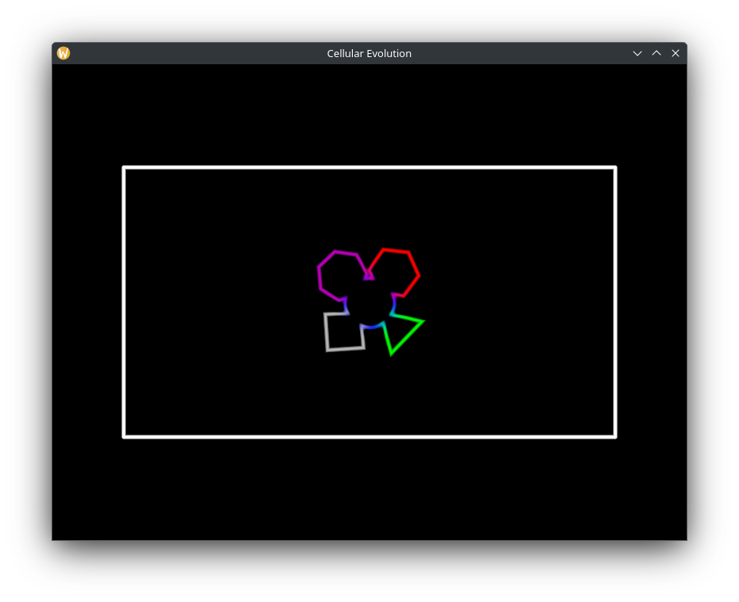

# Cellular Evolution

This project aims to create a simple simulation of artificial life and its evolution.
By modeling cells that interact and change over time,
the goal is to explore how basic rules can lead to interesting behaviors and patterns.

The simulation uses GPU acceleration to improve performance and includes a physics system to handle cell interactions.
It’s a work in progress intended for learning and experimentation rather than a fully polished product.

Whether you’re curious about evolution, simulation, or just enjoy tinkering with Rust and graphics programming,
this project offers a starting point to explore those ideas.




## Project Status
### Note: This project is not yet complete, but it is currently in a stable and usable state.

The core systems — including GPU-accelerated rendering and physics simulation with cell interactions — have been fully implemented.
The application runs reliably and renders cell-based organisms with proper spatial layout and physical behavior.

However, the evolutionary logic — the part of the system responsible for allowing organisms to evolve autonomously over time — is still under development.
Cells can be initialized and simulated, but they do not yet exhibit adaptive or evolutionary behavior.

This makes the project suitable for exploration, experimentation, and development, but not yet for studying self-directed evolution.

## Features

- GPU-accelerated rendering
- physics simulation with cell interactions
- modular tile-based renderer


### Requirements

- rustc 1.8.0 or later
- Linux / Windows / macOS
- GPU with Vulkan / DirectX12 / Metal support (wgpu requirements)


```bash
git clone https://github.com/MazMartin/cellular_evolution.git
cd cellular_evolution
cargo build --release
